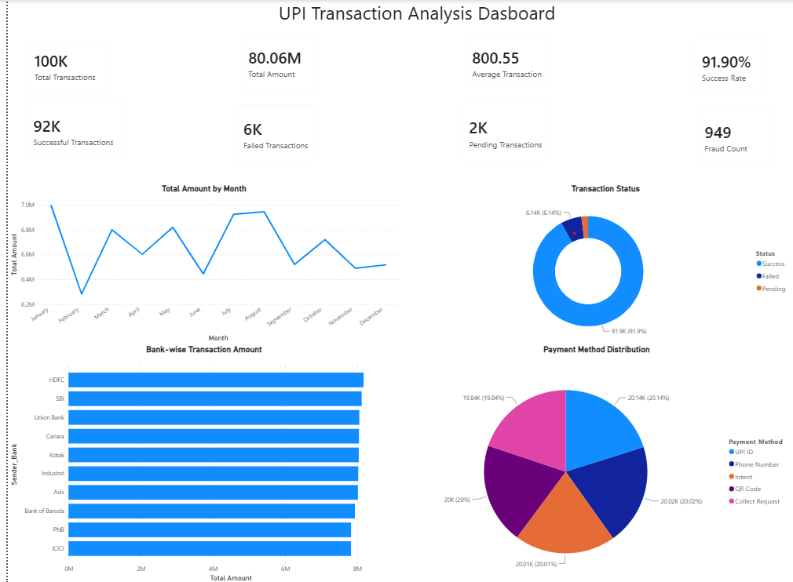
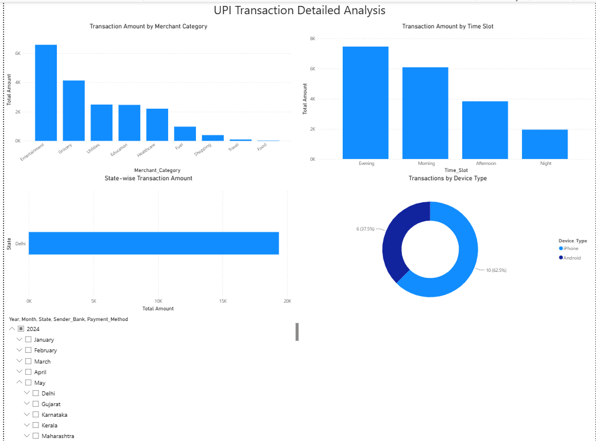

# UPI Transaction Analysis Dashboard

## Project Overview

This project analyzes 100,000 UPI transactions using Python and Power BI to understand transaction trends, payment performance, bank performance, customer behavior, and fraud-related activity.

## Objectives

- Analyze UPI transaction volume and transaction value.
- Measure payment success and failure rates.
- Compare bank-wise transaction performance.
- Analyze payment method usage.
- Identify merchant category trends.
- Monitor fraud-related transactions.
- Analyze transaction trends across time, states, and devices.
- Generate actionable business insights.

## Tools & Technologies

- Python
- Pandas
- Power BI
- DAX
- CSV

## Project Workflow

Python
↓
Data Cleaning
↓
Exploratory Data Analysis
↓
Cleaned Dataset
↓
Power BI
↓
Interactive Dashboard
↓
Business Insights

## Dashboard Features

### Page 1 - Executive Dashboard

- Total Transactions
- Total Transaction Amount
- Average Transaction Amount
- Successful Transactions
- Failed Transactions
- Pending Transactions
- Success Rate
- Fraud Count
- Monthly Transaction Trends
- Transaction Status Distribution
- Bank-wise Transaction Amount
- Payment Method Distribution

### Page 2 - Detailed Analysis

- Transaction Amount by Merchant Category
- Transaction Amount by Time Slot
- State-wise Transaction Amount
- Transactions by Device Type
- Interactive filters and slicers

## Key Insights

- Evaluated monthly transaction value trends.
- Compared transaction performance across banks.
- Identified payment method distribution.
- Analyzed successful, failed, and pending transactions.
- Examined merchant category performance.
- Analyzed transaction behavior across different time slots.
- Monitored fraud-related transactions.
- Examined state-wise and device-wise transaction patterns.

## Business Recommendations

- Investigate major transaction failure patterns to improve payment success rates.
- Strengthen fraud monitoring and detection.
- Optimize payment infrastructure during high-volume periods.
- Improve user experience across commonly used payment methods.
- Focus on high-performing merchant categories and regions.

## Project Files

| File | Description |
|---|---|
| `UPI_Transaction_Analysis_Dashboard.pbix` | Power BI dashboard |
| `cleaned_upi_transactions.csv` | Cleaned transaction dataset |
| `datacleaning.py` | Python data cleaning script |
| `dataset.py` | Dataset preparation script |
| `eda.py` | Exploratory data analysis script |
| `dashboard_page1.png` | Executive dashboard screenshot |
| `dashboard_page2.png` | Detailed analysis screenshot |

## Dashboard Preview

### Executive Dashboard

### Detailed Analysis

## Future Enhancements

- Add predictive analysis for transaction failures.
- Develop advanced fraud detection models.
- Add automated data refresh.
- Publish the dashboard to Power BI Service.
- Add real-time transaction monitoring.

## Author

Vishal

Aspiring Data Analyst | Python | Power BI | SQL | Excel
